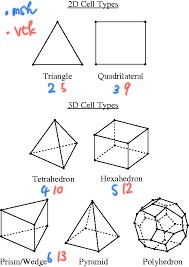

# mesh-deformation

メッシュ変形のための C#コードと gmsh コード

# 使っているもの

- gmsh
  - [gmsh のサイト](https://gmsh.info/#Links)
  - [gitlab にあるソースコード](https://gitlab.onelab.info/gmsh/gmsh)
- 自作コード（c#）

## Basic Installation

- python3 系がインストールされている必要があります。筆者は python3.11 を利用している。
  python のライブラリである、数値計算を高速に扱うための「numpy」と gmsh を利用可能にするための「gmsh」を追加する必要があります。バージョンの違いをなくすために以下のように gmsh のバージョンを 4.11.1 としてライブラリを追加してください。
  <span style="color: red;">**_先頭のドル記号は入力不要です。_**</span>

  ```bash
  # on your windows pc

  #バージョンを揃えるために一度gmshをアンインストールします。
  $ pip3 uninstall gmsh

  $ pip3 install numpy
  # または、pip install numpy
  $ pip3 install gmsh==4.11.1
  # または、pip3 install gmsh==4.11.1

  # python3系なので、pip3でインストールしたほうがよいと思います。
  # pipとpip3の違いはよくわからないので、各自調べてください。
  ```

- 以下のコマンドを入力して、以下のような出力が返ってきたら、無事にライブラリに追加されています。

  ```bash
  # on your windows pc

  # 入力
  $ pip3 list
  # 出力
  Package    Version
  ---------- -------
  gmsh       4.11.1
  numpy      1.23.4
  pip        22.3
  setuptools 65.5.0
  ```

## tutorial

- [python サンプルコードがいっぱいある場所](./gmsh-4.11.1-Windows64/tutorials/python/README.txt)
- これを一個ずつ試して行けば大体やっていることはわかる

## mesh format (「MeshFormat 2.2 0 8」形式について)

- [mesh.py](./mesh.py)から出力した「model-before.msh」を参考にメッシュのフォーマットを説明する
- [msh の説明サイト](http://www.manpagez.com/info/gmsh/gmsh-2.2.6/gmsh_63.php)に乗っている通り(公式ドキュメントにも乗っている)

### 全体像

```bash
$MeshFormat
2.2 0 8
$EndMeshFormat
$PhysicalNames
1
2 10 "surface"
$EndPhysicalNames
$Nodes
11
1 0 0 0
2 1 0 0
3 1 4 0
4 0 4 0
5 1 2.66666666667037 0
6 1 1.333333333338887 0
7 0 2.66666666667037 0
8 0 1.333333333338887 0
9 0.5 0.6666666666694434 0
10 0.5 2.000000000004628 0
11 0.5 3.333333333335185 0
$EndNodes
$Elements
12
1 2 2 10 1 8 1 9
2 2 2 10 1 2 6 9
3 2 2 10 1 6 5 10
4 2 2 10 1 7 8 10
5 2 2 10 1 5 3 11
6 2 2 10 1 4 7 11
7 2 2 10 1 1 2 9
8 2 2 10 1 6 8 9
9 2 2 10 1 5 7 10
10 2 2 10 1 8 6 10
11 2 2 10 1 7 5 11
12 2 2 10 1 3 4 11
$EndElements
```

## 細かく説明

- 最初の 3 行はおまじない

```bash
$MeshFormat
2.2 0 8 # OpenFOAM で用いる場合にはこのバージョンの gmsh フォーマットでないと動かない
$EndMeshFormat
```

- 境界条件のための辞書

```bash
$PhysicalNames
1 # 何個あるか
2 10 "surface" # 最初の数字の2は2次元の意味、10は後述する、"surface"は自分でつけれる（大体はINLETみたいな名前にする）
$EndPhysicalNames
```

- node

```bash
$Nodes
11 # 11個のノードがある
1 0 0 0 # 最初の数字はインデックス、あとは三次元座標
2 1 0 0
3 1 4 0
4 0 4 0
5 1 2.66666666667037 0
6 1 1.333333333338887 0
7 0 2.66666666667037 0
8 0 1.333333333338887 0
9 0.5 0.6666666666694434 0
10 0.5 2.000000000004628 0
11 0.5 3.333333333335185 0
$EndNodes
```

- element

  - elements について

    ```sh
    element_number, element_type, ?, physical_number, entities_number(entityID), node-number-list
    (例)
    1 2 2 10 1 8 1 9
    要素番号1, 要素タイプ2(二次元の三角形), ---?---, どこのphysicalに所属するか1, どこのentitiesに所属するか, 要素がどのノードによって作られるか(8と1と9)
    ```

    - element の要素タイプについて

      | 表現する要素     | .msh | .vtk |
      | :--------------- | :--: | ---: |
      | 三角形           |  2   |    5 |
      | 四角形           |  3   |    9 |
      | テトラ(四面体)   |  4   |   10 |
      | ヘキサ(六面体)   |  5   |   12 |
      | プリズム(三角柱) |  6   |   13 |

       |

    - element の node-number-list の順番の定義
      - [参考リンク](http://www.manpagez.com/info/gmsh/gmsh-2.2.6/gmsh_65.php#SEC65)

```bash
$Elements
12 # 12個のエレメントがある
1 2 2 10 1 8 1 9
2 2 2 10 1 2 6 9
3 2 2 10 1 6 5 10
4 2 2 10 1 7 8 10
5 2 2 10 1 5 3 11
6 2 2 10 1 4 7 11
7 2 2 10 1 1 2 9
8 2 2 10 1 6 8 9
9 2 2 10 1 5 7 10
10 2 2 10 1 8 6 10
11 2 2 10 1 7 5 11
12 2 2 10 1 3 4 11
$EndElements
```
